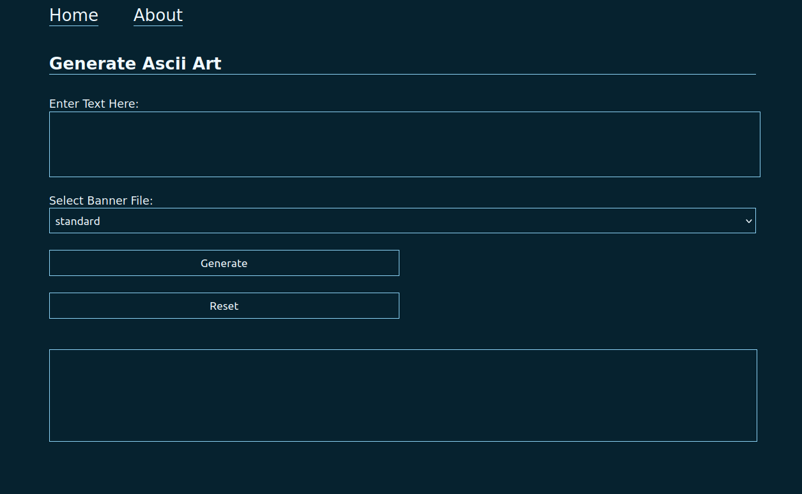
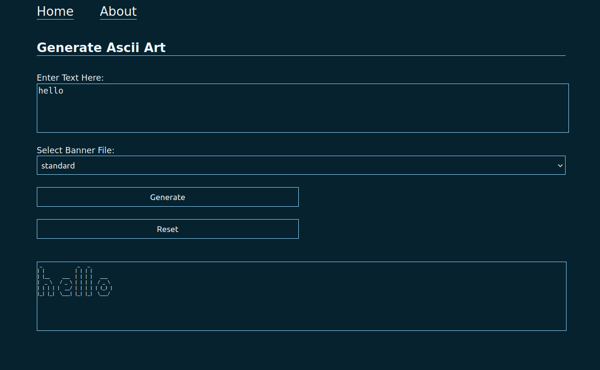
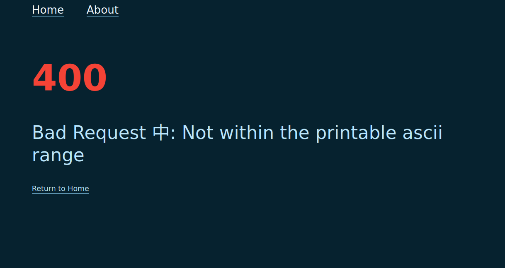
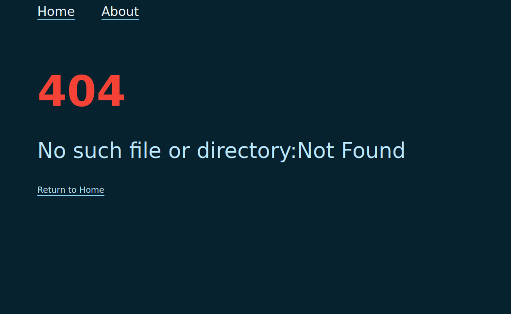
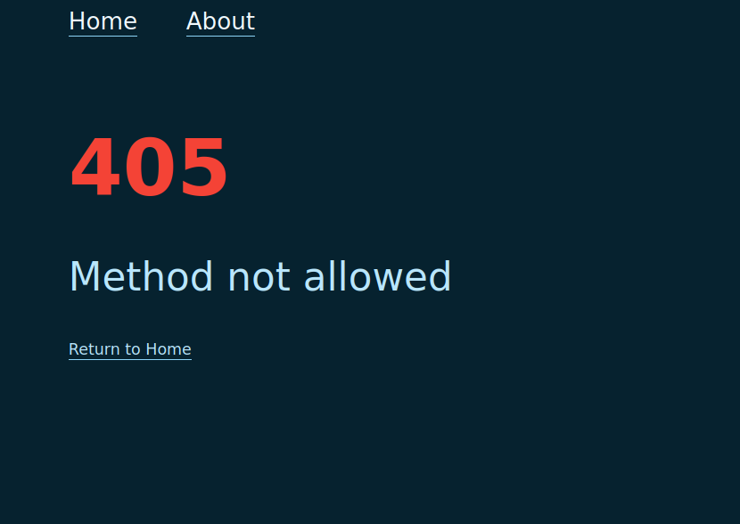

# ASCII-ART-WEB-STYLIZE
## Description
The ASCII-ART-WEB-STYLIZE is an extension of ascii-art-web.The web application that allows a user to generate ASCII art based on different art styles and input text. Users can select an art style and provide text, and the application will generate and display ASCII art corresponding to the chosen style.
## Usage: How to run
To run the ASCII ART WEB STYLIZE application, follow these steps:
1. Install dependancies:

    Ensure you have Go installed. If not, download and install it from [here](https://go.dev/doc/install).

2. Clone the repository:
    ```bash
    git clone https://learn.zone01kisumu.ke/git/quochieng/ascii-art-web-stylize.git
    cd ascii-art-web-stylize
    ```
3. Run the server:
    ```bash
    go run .
    ```
4. Access the server:
    Open your web browser and navigate to http://localhost:8080 to start using the ASCII Art Web


## Implementation
The implementation of the ASCII ART WEB STYLIZE is structured as follows:

* main.go: The main entry point for the web application. It initializes the server and handles incoming HTTP requests.

* handlers/: Contains the HTTP handler functions for GET and POST requests for the web application.
    1. getrequest.go: The main GET entry point on route "/" for the web application

    2. postrequest.go: The main POST entry point on route "/ascii-art" for the web application

    3. getabout.go: It handles the GET requests for the about page.

    4. errors.go: It renders error pages for all available errors that may occurs on the webpage.

* ascii-art/: Contains the core logic for generating ASCII art.

    1. ascii-art.go: Main logic for ASCII art generation.

    2. ascii-art_test.go: Unit tests for the core ASCII art generation logic.

    3. ascii/printascii.go: Functions for printing ASCII art.

    4. banner/readbanner.go: Functions for reading different banner styles.

    5. banner/readbanner_test.go: Tests for banner reading functions.

    6. banner/shadow.txt, standard.txt, thinkertoy.txt: Different banner styles.

    7. errs/errorchecks.go: Error handling for the ASCII art generation.

    8. errs/errorchecks_test.go: Tests for error handling functions.

    


* static/: Contains static files such as CSS.

    1. css/styling.css: Stylesheet for the web application.


* templates/: Contains HTML templates.

    1. index.html: Main HTML template for the application.

    2. about.html: This template contains information about the application and the authors.

    3. error.html: This template generates error messages for the application.

## Displays
### Home Page

When you first run the application, you will see the home page as shown below:




### Generating ASCII Art

After entering the text and selecting an art style, the generated ASCII art will be displayed as follows: Below is an illustration of how 'hello' shall be displayed from the standard banner file. You can use the drop-down menu to navigate through the displays from the given banner files.



### About Page

The about page displays information about the application and details about the authors.


### Handling Non-Printable ASCII Characters

If you input non-printable ASCII characters, an error message will be displayed:



### Missing Banner File or Template

If a banner file is missing, in our example the shadow.txt file has been deleted, an error message will be displayed indicating the issue:




### Manually Input the route

If we manually insert the route /ascii-art to our server link as a GET request, It shall display the below error message.



### Reset

The webpage has a reset button which clears the input text and the displayed result to enable the user to input text on a clear text area.

## Authors
This project has been authored by:
1. Quinter Ochieng 
2. Hillary Okello
3. John Opiyo
## License
This project is licensed under the [MIT](LICENSE) License
